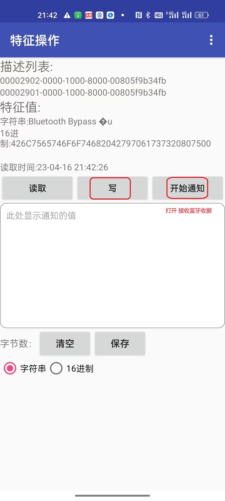

 [中文版资料](./README_zh.md)

# Ble-Uno Introduction


## What is Ble-Uno

​	Ble-Uno is a development board developed by emakefun company, which integrates a low-power Bluetooth chip onto the official Arduino Uno R3 board. It is a wireless Bluetooth-enabled development board that has the same functionality, pins, and usage methods as the standard Arduino Uno R3 board.

The Ble-Uno operates in the 2.4GHz frequency range and uses GFSK modulation. It has a receiver sensitivity of -96dBm and a maximum transmission power of +5dB, allowing for a maximum transmission distance of over 200 meters. The board is designed with the RISC-V architecture CH571F chip.

It supports users to view and modify device names, service UUID, transmission power, pairing passwords, and other instructions through AT commands, making it convenient and fast to use. The product is very small in size, making it suitable for applications with strict size requirements.

​	Providing Android and IOS mobile demo,You can quickly develop a hardware device that communicates with Android and iOS smartphones by leveraging the Arduino application ecosystem. Just like the popular wearable smartphone peripherals, you can use the Ble-Uno platform for development. With Ble-Uno, you can connect to BLE Bluetooth devices and enable communication between two Ble-Uno boards. We also provide developers with great flexibility and support, allowing you to debug the Ble-Uno using AT commands. Additionally, you can add Arduino-compatible expansion boards, sensors, motor drivers, and servo drivers to the Ble-Uno controller, offering even more possibilities for your projects.Support mobile phone download program

## System architecture diagram

 

#### The parameters of Bluetooth Low Energy (BLE)

* The BLE chip: RISC-V architecture ch571F chip (highly compatible with TI CC2540 Bluetooth SOC).
* Working channel: 2.4G
* When the transmission power is 0 dBm, the current is 6mA. 
* The receiving sensitivity is -96 dBm, with a programmable +5 dBm transmission power. 
* In an open environment, the communication distance is approximately 170m with a transmission   power of 0 dBm and approximately 240m with a transmission power of 3 dBm.
* The device supports three types of communication interfaces: USB serial, Arduino serial, and Bluetooth. It can be configured using AT commands, and it also supports switching between master and slave modes.
* The device supports USB virtual serial port, hardware serial port, and BLE three-way transparent transmission. 
* In host mode, the device supports automatic Bluetooth connection to a slave device.
* MTU:67
* Support mobile phone download program

#### Main control core parameters
* Processor: ATmega328PB-AU QFN32
* Digital IO pins: 22 (6 of them used as PWM output).
* Analog input pins：8 (A0~A7) 
* DC current of IO pins：40mA 
* Current of the 5V pin: 500mA when VIN is input.
* Current of the 3.3V pin: 500mA.
* Flash memory: 32KB (0.5KB of which is used for bootloader). 
* SRAM： 2KB
* EEPROM： 1KB
* USB to Serial chip: CH571F chip, compatible with official Arduino Uno drivers.
* Main Frequency：16 MHZ

## Parameter comparison

arduino uno, ble-uno 3.0,  ble-uno4.2  ble-uno5.3  comparison table for four products

| name      | uno r3                                           | ble-uno 3.0                                                  | ble-uno 4.2                                                  | ble-uno 5.3                                                  |
| --------- | ------------------------------------------------ | ------------------------------------------------------------ | ------------------------------------------------------------ | ------------------------------------------------------------ |
|           |  |                                   |                      |                      |
| Picture   | ATmega328P-PU(DIP28)                             | ATmega328P-PU(DIP28)                                         | ATmega328PB-AU(TQFP32)                                       | ATmega328PB-AU(TQFP32)                                       |
| BLE       | No                                               | TI CC2540 BLE4.0<br />0dBm Transmission 30 meters range, power consumption of 24mA<br />not support ble uploard | WCH CH571F BLE4.2<br />0dBm Distance 150m, Transmit Power 6mA<br />support ble uploard | WCH CH58xF BLE5.3<br />0dBm Distance 300m, Transmit Power 6mA<br />support ble uploard |
| driver    | Atmgea16U2 Arduino Uno office driver chip        | CC2540 chip                                                  | Compatible with Arduino Uno office driver                    | Compatible with Arduino Uno officedriver                     |
| Parameter | PCB size：53.4x68.6mm                            | PCB size：53.4x68.6mm                                        | PCB size：53.4x68.6mm                                        | PCB size：53.4x68.6mm                                        |
| Interface | Type-B                                           | Micro-Usb                                                    | Micro-Usb                                                    | Type C                                                       |

### ### Pin description


###  Schematic diagram

[Schematic diagram download](schematic/ble-uno4.2.pdf)


###  Dimensional drawing


###  


###  Indicator light description

* B:  When Bluetooth is not connected, it flashes at a 1-second interval.
      When Bluetooth is connected, it remains solid.
      When Bluetooth is receiving or sending data, it flashes rapidly.
* RX TX: Serial Data Transmission Indicator
* L : The "Blink" LED on pin 13 of Arduino

### Driver installation

The USB interface of Ble-Uno uses the official Arduino-compatible serial driver, so the method for installing the driver is consistent with the driver for the official Arduino Uno.

## BLE-Uno download programs through the Arduino IDE

Ble-uno uses the latest Arduino uno official bootloader, so you need to use Arduino IDE version 1.8.8 or above to download programs
Please go to the [Arduino IDE](https://www.arduino.cc/en/Main/Software) to download the latest IDE

To select the board type as Arduino Uno like below:


Mobile Phone support download programming

[**Mobile Phone Download Link**](https://github.com/nulllab-org/arduino_ble_flash_demo)

# ble-uno connects to electronic devices

## ble-uno connects to android phone

1)	Running the BLE control program [ble_control_led.ino](./example/ble_contorl_led/ble_contorl_led.ino),Open the LED light program on the board's Link (pin 13) 

```c
String ble_data;
int led_pin = 13;

void setup() {
  Serial.begin(115200);
  ble_data = "";
  pinMode(led_pin, OUTPUT);
}

void loop() {
  while (Serial.available() > 0)  
  {
      ble_data += char(Serial.read());
      delay(2);
  }
  if (ble_data.compareTo("on") == 0) {
    Serial.println("turn on led");
    digitalWrite(led_pin, HIGH);
  }
  if (ble_data.compareTo("off") == 0) {
    Serial.println("turn off led");
    digitalWrite(led_pin, LOW);
  }   
  ble_data = "";
}
```

2)	Android or iOS devices cannot be connected or used directly from the settings menu because the settings menu is only designed to connect to classic Bluetooth-compatible devices such as Bluetooth headphones, Bluetooth microphones, and other peripherals. It cannot connect to devices that use low energy Bluetooth (BLE).Install on an Android phone (Android version 4.2 or above)[BleToolsTest](https://github.com/nulllaborg/BleTools/raw/master/NulllabBlutooth/app/release/BleToolsTest.apk) You can refer to the open-source[Android source code](https://github.com/nulllaborg/BleTools)  (Note that Bluetooth and location permissions need to be turned on)like following image）

| Enable location on your phone                                | Allow BLE Testing Tool to access location permission         |
| ------------------------------------------------------------ | ------------------------------------------------------------ |
|  |  |

3）Open the testing app and navigate to the interface. Find the corresponding Bluetooth name（blenanoxxxxxx/blenanoxxxxxxx）and click to connect. You will see four options for testing different functionalities. Since we are only testing if Bluetooth can send and receive data properly, select 'SK Service' and then choose 'SK_KEYPRESSED'.


| Connect to Bluetooth name                                    | Select service                                               | Select char service                                          |
| ------------------------------------------------------------ | ------------------------------------------------------------ | ------------------------------------------------------------ |
|  |  |  |

4)	We select 'SK-KEYPRESSED', and after clicking, as shown in figure 3.1.9, we can see a 'Write' button. Clicking on it will take us to another screen where we can input the desired data to be sent by clicking the 'red box'. After inputting the data, click 'Send' to transmit the data.


|                                                              |                                                              |
| ------------------------------------------------------------ | ------------------------------------------------------------ |
|  |  |

5)	After clicking 'Send' on the string 'on', the message 'turn on led' will be printed on the Serial Monitor of Arduino IDE, and at the same time, the LED on the Ble-Uno will light up. This indicates that the app successfully controls the LED on the main board via Bluetooth. Similarly, after sending the string 'off', the LED on the Ble-Uno will turn off. With this, our Android phone Bluetooth testing is completed.


## Connect ble-uno to Apple phone/computer/tablet

1)	In the App Store, search for 'LightBlue', download the software 'LightBlue RExplorer', and open it.

|                                                              |                                                              |
| ------------------------------------------------------------ | ------------------------------------------------------------ |
|  |  |

2)	After installing the app, open it and scan for ble-uno, then connect to it.

|                                                              |                                                              |
| ------------------------------------------------------------ | ------------------------------------------------------------ |
|  |  |

4)	Select the character type and click on 'Write new value.' You can enter characters to send data to ble-uno.

|                                                              |                                                              |                                                              |
| ------------------------------------------------------------ | ------------------------------------------------------------ | ------------------------------------------------------------ |
|  |  |  |

5) After clicking 'Done,' the string 'on' will be sent. Open the Serial Monitor in Arduino IDE and observe the message 'turn on led' printed. At the same time, observe the LED on ble-uno to light up. This indicates that the app successfully controls the LED on the Bluetooth board. Similarly, when the string 'off' is sent, the LED on ble-uno will turn off. This completes our Bluetooth testing on iOS.


## Connect ble-uno with Windows 10 Bluetooth

Your laptop running Windows 10 cannot directly connect to ble-uno through the Bluetooth settings, it only support classic Bluetooth. In this case, you can download the 'Bluetooth LE Explorer' from the Microsoft Store

If you want to connect ble-uno to Windows 10 using the built-in Bluetooth, you will need to develop your application based on the official Microsoft Bluetooth Low Energy (BLE) SDK. You can refer to the developer documentation at
<https://docs.microsoft.com/zh-cn/windows/uwp/devices-sensors/gatt-server>
and watch the video tutorial at  <https://channel9.msdn.com/Events/Build/2017/P4177>
Fortunately, Windows 10 provides professional source code examples that you can use as a reference. You can find them at the following repositories:
<https://github.com/Microsoft/Windows-universal-samples/tree/master/Samples/BluetoothLE>
<https://github.com/Microsoft/BluetoothLEExplorer>
However, please note that this process can be complex and time-consuming. If it is not necessary, I strongly recommend using two ble-uno devices to accomplish your goal. You can find more information on this in the subsequent chapters.

# AT Instruction Introduction

## AT instruction set

The AT instruction of Ble-Uno can be controlled through the hardware serial ports 0 (RX) and 1 (TX) provided by Arduino. The baud rates supported are 9600, 19200, 38400, 57600, and 115200. The default baud rate for the Ble-Uno serial port is 115200 bps.

AT instruction can also be used to control directly through a Type-C data cable and control through the APP using the '0xFFE2' characteristics.

（Note: When sending AT commands, a carriage return and line feed must be added. AT commands can only take effect when the module is not connected. Once the Bluetooth module is connected to a device, it enters data transparent mode. AT commands are case-sensitive and end with a carriage return and line feed characters：\r\n））

| Sequence | Instruction                     | Description                                                  | Master/Slave | Default |
| -------- | ------------------------------- | ------------------------------------------------------------ | ------------ | ------- |
| 1        | AT                              | Test                                                         | M/S          |         |
| 2        | AT+ALL                          | Print all configuration information of ble-uno               | M/S          |         |
| 3        | AT+RESET                        | Software reset the BLE Bluetooth chip                        | M/S          |         |
| 4        | AT+TARGE_RESET                  | Reset Arduino(Atmega328PB chip)                              | M/S          |         |
| 5        | AT+VER                          | View the firmware version number of Ble-Uno                  | M/S          |         |
| 6        | AT+BAUD                         | Configure the baud rate of the serial port                   | M/S          | 115200  |
| 7        | AT+NAME                         | View and configure Bluetooth broadcast name                  | bleunoxxxxxx |         |
| 8        | AT+MAC                          | View and configure 12-bit MAC address of the Bluetooth       | M/S          |         |
| 9        | AT+AUTH                         | Set whether Bluetooth connection requires authentication     | S            | 0       |
| 10       | AT+PASS                         | Set the password for the Bluetooth connection                | S            | 123456  |
| 11       | AT+ROLE                         | Configure the master-slave mode                              | M/S          | 1       |
| 12       | AT+SCAN                         | Scan for nearby Bluetooth devices                            | M            |         |
| 13       | AT+CONN                         | Connect to the Bluetooth device corresponding to the index of the scan result | M            |         |
| 14       | AT+CON                          | Connect to the Bluetooth device with the corresponding MAC address | M            |         |
| 15       | AT+AUTOCON                      | Automatically bind and connect to the last successfully connected slave device, the settings will take effect after restarting | M            | 0       |
| 16       | AT+DISCON                       | Disconnect the current connection                            | M            |         |
| 17       | AT+BLEUSB                       | Set the Bluetooth USB and Bluetooth data transfer mode       | M/S          | 0       |
| 18       | AT+TXPOWER                      | Set the Bluetooth transmit power                             | M/S          | 0       |
| 19       | AT+MINI_INTERVAL                | Set the minimum communication interval for ble-uno           | M/S          | 6       |
| 20       | AT+MAX_INTERVAL                 | Set the maximum communication interval for ble-uno           | M/S          | 6       |
| 21       | AT+SERVUUID                     | Get the Bluetooth characteristic code SERVUUID               | M/S          | 0xFFE0  |
| 22       | AT+CHARUUID                     | Get the character characteristic code CHARUUID               | M/S          | 0xFFE1  |
| 23       | AT+SETTING                      | Restore factory system settings, with parameters             | M/S          |         |
| 24       | AT+SLEEP（Not implemented yet） | Set sleep mode                                               | M/S          |         |

## Detailed explanation of AT Instruction set

1、Test Instruction

| Instruction | Response | Parameter |
| ----------- | -------- | --------- |
| AT          | OK       | None      |

2、Print all configuration information of ble-uno

| Instruction | Response                                   | Parameter |
| ----------- | ------------------------------------------ | --------- |
| AT+ALL      | Detailed configuration information<br />OK | None      |

3、Software reset the BLE Bluetooth chip

| Instruction | Response | Parameter |
| ----------- | -------- | --------- |
| AT+RESET    | None     | None      |

4、Reset Arduino main control 

| Instruction    | Response | Parameter |
| -------------- | -------- | --------- |
| AT+TARGE_RESET | OK       | None      |

5、View the firmware version number of ble-uno

| Instruction | Response                                               | parameter |
| ----------- | ------------------------------------------------------ | --------- |
| AT+VER      | +VERSION=v1.0<br/>+DATE=Apr 16 2023<br/>+TIME=<br/> OK | None      |

6、Configure the baud rate of the serial port

| Instruction      | Response                | Parameter                                               |
| ---------------- | ----------------------- | ------------------------------------------------------- |
| AT+BAUD=< Param> | +BAUD=<  baud ><br />OK | 0:9600 <br>1:19200 <br>2:38400 <br>3:57600 <br>4:115200 |

7、Configure Bluetooth name 

| Instruction       | Response                | Parameter      |
| ----------------- | ----------------------- | -------------- |
| AT+NAME=< Param > | +NAME=< param ><br />OK | Bluetooth name |

8、View or configure MAC address of the Bluetooth

| Instruction | Response                | Parameter |
| ----------- | ----------------------- | --------- |
| AT+MAC      | +MAC=< Result ><br />OK | None      |

9、Set whether Bluetooth connection requires authentication

| Instruction | Response                 | Parameter                                |
| ----------- | ------------------------ | ---------------------------------------- |
| AT+AUTH     | +AUTH=< Result ><br />OK | 0: no need <br />1: need authenticatuion |

10、Set the password for the Bluetooth connection

| Instruction       | Response                | Parameter    |
| ----------------- | ----------------------- | ------------ |
| AT+PASS=< Param > | +PASS=< Param ><br />OK | 6 bit numble |

11、Query or set Bluetooth master/slave mode

| Instruction       | Response                | Parameter             |
| ----------------- | ----------------------- | --------------------- |
| AT+ROLE=< Param > | +ROLE=< Param ><br />OK | 0:master <br> 1:slave |

12、Scan for nearby slaves in Bluetooth host mode

| Instruction | Response                                                     | Parameter |
| ----------- | ------------------------------------------------------------ | --------- |
| AT+SCAN     | +SCAN <br> OK<br />mac[1]:xxxx <br>mac[2]:xxxx <br/> …… <br> | None      |

13、Connect to a slave Bluetooth device by scanning return subscript

| Instruction         | Response          | Parameter                             |
| ------------------- | ----------------- | ------------------------------------- |
| AT+CONN=<  Param  > | OK+CONN=< Param > | Scan slave Bluetooth subscript number |

14、Connect to a slave Bluetooth device by using the MAC address

| Instruction      | Response         | Parameter                      |
| ---------------- | ---------------- | ------------------------------ |
| AT+CON=< Param > | OK+CON=< Param > | Bluetooth address of the slave |

+SCAN
OK
mac[1] 3e:bb:9e:e4:e9:9a
mac[2] 8c:5a:f8:ef:5c:f8
mac[3] 6b:9c:b3:c4:4b:0c
mac[4] 17:cc:ef:66:40:b1
mac[5] fd:e2:4e:af:ea:da
mac[6] 67:3a:b1:45:c2:e8
mac[7] d0:44:7a:9e:e4:e4
OK
AT+CONN=1 represents Connecting to the second Bluetooth device obtained from the scan
AT+CON=d0:44:7a:9e:e4:e4 Directly connect to the device with the MAC address d0:44:7a:9e:e4:e4

15、Enable Bluetooth auto-connect mode. When enabled, the Bluetooth module will automatically connect to the last successfully connected device

| Instruction            | Response                     | Parameter                                        |
| ---------------------- | ---------------------------- | ------------------------------------------------ |
| AT+AUTOCON=<  Param  > | +AUTOCON=<  Param  ><br />OK | 0:Disable auto-connect <br>1:Enable auto-connect |

16、Disconnect the currently connected Bluetooth device

| Instruction | Response        | Parameter |
| ----------- | --------------- | --------- |
| AT+DISCON   | +DISCON<br />OK | None      |

17、Set whether a password is required for the Bluetooth connection

| Instruction         | Response                | Parameter                                                  |
| ------------------- | ----------------------- | ---------------------------------------------------------- |
| AT+AUTH=<  Param  > | +AUTH=< Param ><br />OK | 0:Connect without a password <br>1:Connect with a password |

18、Set the USB and Bluetooth data transfer mode for Bluetooth

| Instruction         | Response                  | Parameter                                                    |
| ------------------- | ------------------------- | ------------------------------------------------------------ |
| AT+BLEUSB=< Param > | +BLEUSB=< Param ><br />OK | 0:Close<br>1:Transfer USB serial data to BLE<br>2:Transfer BLE data to USB serial port<br>3:USB serial port data and BLE transparent transmission |

19、Set the transmission power of Bluetooth

| Instruction                | Response                           | Parameter                                                    |
| -------------------------- | ---------------------------------- | ------------------------------------------------------------ |
| AT+MINI_INTERVAL=< Param > | + MINI_INTERVAL=< Param ><br /> OK | For PC and Android devices, it is recommended to set the transmission power to 10 <br> For IOS devices, it is recommended to set the transmission power to 20 |

20、Set the maximum communication interval for the BLE chip, in milliseconds.

| Instruction               | Response                          | Parameter                                                    |
| ------------------------- | --------------------------------- | ------------------------------------------------------------ |
| AT+MAX_INTERVAL=< Param > | + MAX_INTERVAL=< Param ><br /> OK | For PC and Android devices, it is recommended to set the connection interval to 10  <br> For IOS devices, it is recommended to set the connection interval to 40 |

21、Obtain the UUID of a BLE service characteristic

| Instruction | Response                 | Parameter |
| ----------- | ------------------------ | --------- |
| AT+SERVUUID | +SERVUUID=0xffe0<br />OK |           |

22、Obtain the BLE character feature code UUID

| Instruction | Response                 | Parameter |
| ----------- | ------------------------ | --------- |
| AT+CHARUUID | +CHARUUID=0xffe0<br />OK |           |

23、System Settings

| Instruction          | Response                   | Parameter                                                    |
| -------------------- | -------------------------- | ------------------------------------------------------------ |
| AT+SETTING=< Param > | +SETTING=< Param ><br />OK | DEFAULT Restore to Factory Settings <br> PARI_DEFAULT Clear Pairing Information |

## Development Guide

Because the Bluetooth of the product has transparent transmission function, Bluetooth programming actually involves reading and writing operations on the Arduino serial port (Serial). When programming, we need to pay attention to two points:
1、The BLE protocol specifies that the length of each Bluetooth data packet cannot exceed 64 bytes. Our Bluetooth module has implemented packet segmentation for transmission, but there is a low probability of packet loss. Therefore, when the data exceeds 64 bytes, dividing it into smaller packets and sending them using Arduino is the most reliable method.
2、Each packet of data should have an interval of more than 100ms between transmissions, otherwise, there is a higher chance of packet loss.

## AT Instruction Testing

Ble-Uno supports three types of AT Instruction configuration methods：

1)	You can directly send AT commands through the USB serial port by opening the Serial Monitor in the Arduino IDE

To configure the serial port baud rate to 115200 and select newline (NL) and carriage return (CR) as the line ending characters.


2）How do use AT Instruction in code

The hardware serial port (RX0, TX1) of Arduino is directly connected to the serial port module of the Bluetooth. Therefore, we can send AT commands directly through the hardware serial port of Arduino.By operating the Serial functions of Arduino, we can communicate with the Bluetooth module

```c
String ble_data;
int led_pin = 13;

void setup() {
  Serial.begin(115200);
  pinMode(led_pin, OUTPUT);
  Serial.println("AT+ROLE=0");  // Set the Bluetooth as the host
  delay(50);  // After setting the AT commands, it is necessary to delay for 10ms
  Serial.println("AT+CON=83:46:8c:e4:c2:84");  //Connect to the Bluetooth slave with the MAC address
  delay(50);
}

void loop() {
  while (Serial.available() > 0)  
  {
      ble_data += char(Serial.read());
      delay(2);
  }
  if (ble_data.endsWith("OK\r\n") > 0) {   //Check if the AT command response is "OK"
    Serial.println("connect success");
    digitalWrite(led_pin, HIGH);
  }
  if (ble_data.endsWith("ERROR\r\n") > 0) { //Check if the AT command response is "ERROR"
    Serial.println("connect fail");
    digitalWrite(led_pin, LOW);
  }
  ble_data = "";
}
```

1)  Steps to configure AT Instruction in a mobile app

| Selecting the characteristics for AT commands      | Click "Start Notification"                         | Click "Add New Line"                               |
| -------------------------------------------------- | -------------------------------------------------- | -------------------------------------------------- |
|  |  |  |


## Testing the communication between two Ble-Uno devices in master-slave mode

 In many applications, we need two Ble-Uno devices to accomplish our ideas. Below are two classic ways to achieve communication between two Ble-Uno devices.

一、 The host Ble-Uno sends control commands to the slave Ble-Uno's LED via USB to Serial communication from a computer.

Set the USB and Bluetooth data transfer modes of both Ble-Uno devices to USB serial data and BLE transparent, i.e., AT+BLEUSB=3


Slave device burn[ble_control_led.ino](./example/ble_contorl_led/ble_contorl_led.ino) 

After sending "on" through the USB serial port of the host device, we can see the LED on the slave device light up. After sending "off" through the USB serial port, we can see the LED on the slave device turn off.

二、 We can separately program the host and the slave Ble-Uno to control the LED on the slave Ble-Uno to turn on and off.

The host program is as follows[master](./example/ble_communication/master/master.ino)

```c
String ble_data;
int led_pin = 13;
int ble_status = 0;
void setup() {
  Serial.begin(115200);
  pinMode(led_pin, OUTPUT);
  Serial.println("AT+ROLE=0");  // Set the Bluetooth as the host
  delay(50);
  Serial.println("AT+BLEUSB=0");  // Set the data communication mode to 0
  delay(50);
  Serial.println("AT+CON=83:46:8c:e4:c2:84");  // Connect to the Bluetooth slave with the MAC address
  //delay(10);
  ble_data = "";
  while (Serial.available() > 0)  
  {
      ble_data += char(Serial.read());
      delay(2);
  }
  if (ble_data.endsWith("OK\r\n") > 0) {
    Serial.println("connect success");
    digitalWrite(led_pin, HIGH);
	ble_status = 1;
  }
  if (ble_data.endsWith("ERROR\r\n") > 0) {
    Serial.println("connect fail");
    digitalWrite(led_pin, LOW);
	ble_status = 0;
  }
}

void loop() {

  if (ble_status)
  {
	  Serial.print("on");
	  delay(1000);
	  Serial.print("off");
	  delay(1000);
  }
}
```

1)  The Slave program is as follows[slave](./example/ble_communication/slave/slave.ino)

```c
String ble_data;
int led_pin = 13;

void setup() {
  Serial.begin(115200);
  pinMode(led_pin, OUTPUT);
  Serial.println("AT+ROLE=1");  // Set the Bluetooth as the slave
  delay(50);
  Serial.println("AT+BLEUSB=0");  //Set the data communication mode to 0
  delay(50);
}

void loop() {
  while (Serial.available() > 0)  
  {
      ble_data += char(Serial.read());
      delay(2);
  }
  if (ble_data.compareTo("on") == 0) {
    Serial.println("turn on led");
    digitalWrite(led_pin, HIGH);
  }
  if (ble_data.compareTo("off") == 0) {
    Serial.println("turn off led");
    digitalWrite(led_pin, LOW);
  }   
  ble_data = "";
}
```

After successful connection, we can see that the LED on the slave device blinks once every second.

## Frequently Asked Questions

**1)	Questions：What are the differences between the Ble-Uno and other office Arduino Uno R3 boards, and how do I get started with this development board?**

Answer： The Ble-Uno is based on the official Arduino Uno R3, Its driver is compatible with the official Arduino driver, and the interface has been upgraded from Mini-USB to Type-C, while the pins and functionalities are fully compatible with the regular official Arduino  Uno R3. If you are not using the Bluetooth feature, you can refer to the usage instructions for the Arduino Uno R3. If you want to use Bluetooth, please refer to the user manual.

**2)	Questions：How to connect Bluetooth to a mobile phone or computer?**
Answer： The Ble-Uno is a low-power Bluetooth device and cannot be directly connected through the Bluetooth settings on a mobile phone. To connect to it, you will need to use an Android app called BLETestTools.apk (or iOS app called LightBlue). If you want to develop and reference the source code for further customization, on Windows, you can use the classic Bluetooth connection method through the Windows settings. For this, you will need to refer to the BLE SDK development documentation provided by Microsoft on their official website.

**3） Questions：Why can't my phone connect to Ble-Uno, and even if it connects, it can't communicate?**

Answer：Please check if your phone supports Bluetooth 4.2. Please use the Scan button within the BLE testing app to scan and connect to the Ble-Uno. Connecting does not require a password. Do not try to connect through the Bluetooth settings interface on your phone, as that is for connecting to classic Bluetooth devices.

**4）Questions：How to use Ibeacon and mesh function？**

Answer：It is currently not supported, but we will consider adding support in future updates.

**5）Questions：Does the Ble-Uno support multiple connections? I want to use one central device to connect to multiple peripheral devices. How many devices can it connect to at most？**

Answer：The Ble-Uno does not currently support multiple connections, but you can achieve a similar concept of connecting to multiple peripherals by continuously switching and bonding with different peripheral devices.

**6)  Questions：Why can't Bluetooth 4.2 devices from the Ble-Uno series connect to Bluetooth 2.0 devices？**

Answer：Our Ble-Uno series, in order to achieve extremely low power consumption, utilizes Bluetooth Low Energy (Bluetooth Smart) as a single-mode. Hardware and software optimizations have been made specifically for BLE, which means it does not support connecting to Bluetooth 2.0 devices.

## Contact us

**Technology+Cooperation**  wechat number: jundi0808(ken@emakefun.com)