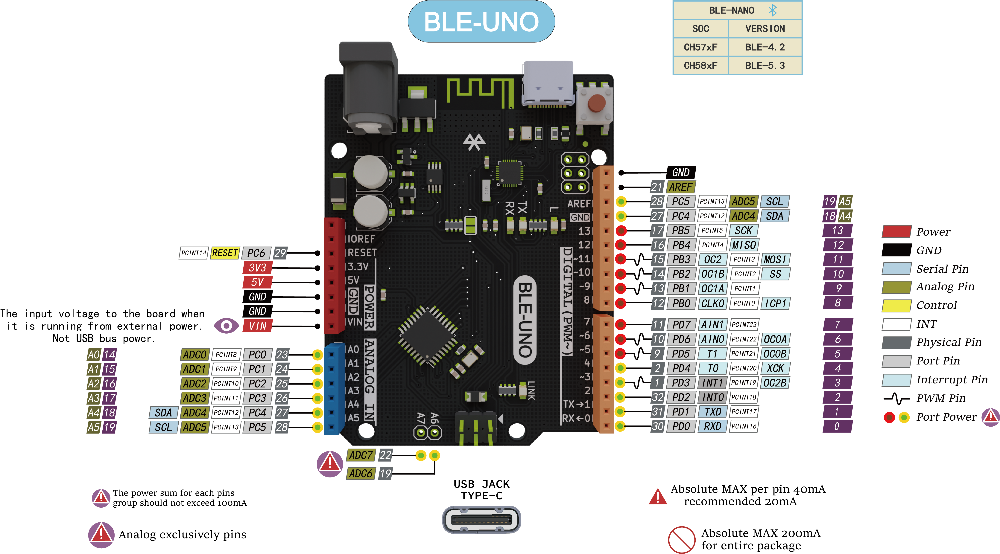
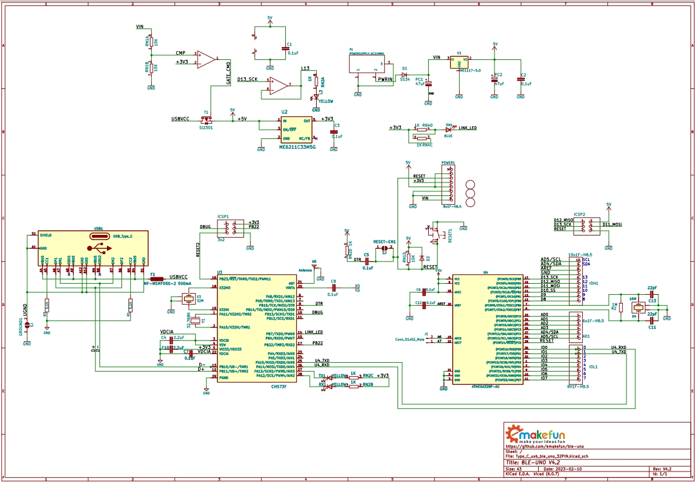
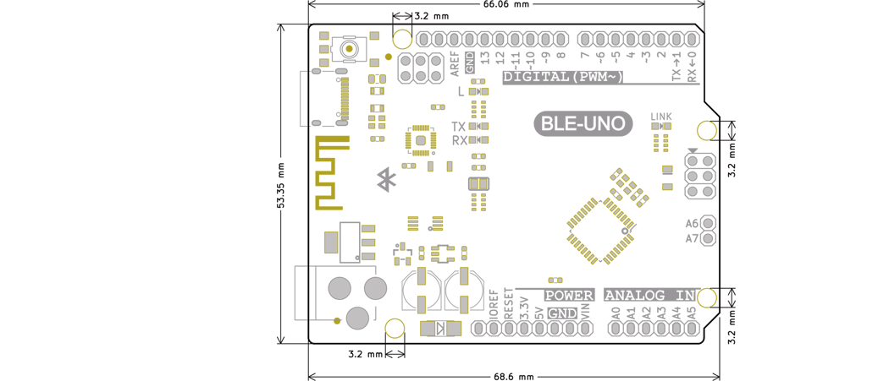

# ble-uno 使用说明书

## 什么是ble-uno

​	ble-nano是emakefun公司基于官方标准Arduino Uno R3主板上集成低功耗蓝牙芯片而开发一款具备无线蓝牙功能的开发板，它的功能和引脚，使用方法，完全兼容标准的Arduino Uno R3主板，工作频段为2.4GHZ 范围，调制方式为 GFSK， 接收灵敏度-96dBm，最大发射功率为+5db，最大发射距离超过200米，采用RISC-V架构CH573芯片设计，支持用户通过AT命令查看修改设备名、服务UUID、发射功率、配对密码等指令，方便快捷使用。产品身材非常小，适合于很多对于体积有苛刻限制的应用。

​	提供Android和IOS手机demo，你可以借助Arduino应用生态，快速开发出一款与手机通信的硬件设备。正如现在非常火爆的可穿戴式手机周边设备，都可以用ble-uno这款平台开发，你可以使用ble-uno与BLE蓝牙设备连接，也可以两个ble-uno主从通信。同时我们为开发者提供了极大的自由度和支持准备，用户不仅可以通过AT指令调试ble-uno，你还可以在ble-uno控制器上添加Arduino兼容的扩展板、传感器、电机和舵机驱动等，当然最大的亮点是你可以通过手机蓝牙直接给ble-uno下载程序。

## 系统架构图

 

## 核心参数

#### 低功耗蓝牙BLE参数

* BLE芯片: RISC-V架构ch57xF芯片（高度兼容TI CC2540蓝牙SOC）
* 工作频道: 2.4G
* 0dBm 发送功率时电流 6mA  
* 接收灵敏度  -96dBm，可编程+5dBm 发送功率  。
* 传输距离：空旷情况下，在0dB发送功率通讯距离约170m，在 3dBm 发送功率时约 240m 
* 支持usb串口，arduino串口，蓝牙三种方式，AT指令配置，支持主从模式切换
* 支持USB虚拟串口，硬件串口，BLE三向透传 
* 主机模式下支持蓝牙自动连接从机
* MTU为67，单次数据发送量最大为64Byte

#### 主控核心参数

* 处理器: ATmega328P-AU QFP32
* 数字IO引脚：22个(其中6个用作PWM输出)
* 模拟输入引脚：6 (A0~A5) 
* IO引脚直流电流：40mA 
* 5V 引脚电流：VIN输入时500mA
* 3.3V引脚电流 :  500mA
* Flash内存：32KB(其中0.5KB用于引导加载程序) 
* SRAM： 2KB
* EEPROM： 1KB
* USB转串口芯片： CH57xF芯片，兼容arduino官方uno驱动
* 工作时钟：16 MHZ

Arduino Uno R3 , ble-uno3.0,  ble-uno4.2  ble-uno5.3 四款产品对比表格

| 名字     | Uno R3                 | ble-uno3.0                                       | ble-uno4.2                                                   | ble-uno5.3                                             |
| -------- | ---------------------- | ------------------------------------------------ | ------------------------------------------------------------ | ------------------------------------------------------ |
| 图片     |  |  |  |  |
| 主控芯片 | ATmega328P-AU(QFP32)   | ATmega328P-MU(QFN32)                             | ATmega328P-AU(QFP32)                                       | ATmega328P-AU(QFP32)                                   |
| BLE      | 无                     | TI CC2540蓝牙4.0 0dBm发射 距离30米 功耗24mA | WCH CH571F BLE4.2 0dBm距离150m  发射功耗6mA             | BLE5.3 距离300m                                   |
| 驱动     | Atmega16U2串口芯片 | CC2540驱动                                       | 兼容Arduio Uno驱动                                           | 兼容Arduio Uno驱动                                     |
| 参数     | PCB尺寸：53.4x68.6mm   | PCB尺寸：53.4x68.6mm                             | PCB尺寸：53.4x68.6mm                                         | PCB尺寸：53.4x68.6mm                                   |
| 接口     | Type-B                 | Micro-Usb                                        | Micro-Usb                                              | Type C                                                 |

### 引脚说明

###  原理图

[原理图下载](schematic/ble-uno4.2.pdf)

###  尺寸标注图

###  

### 指示灯说明

* B:  蓝牙连接状态指示灯-当蓝牙未连接时，1s间隔闪烁，当蓝牙连接上后常亮；蓝牙接收或者发送数据时，会快闪
* RX TX: 串口收据收发指示灯
* L 为 arduino的13引脚blink灯

# ble-uno驱动安装

​		ble-uno的usb采用的是兼容Arduino的官方串口驱动，所以安装驱动的方法和官方Arduino Uno驱动是一致的.

## ble-uno通过arduion IDE下载程序

ble-uno烧写最新版本Bootloader所以需要使用最新IDE（1.8.8版本以上）来烧写程序
请前往 [Arduino官网](https://www.arduino.cc/en/Main/Software)  下载最新IDE

1.选择开发板类型为Arduino/Genuino Uno

2.勾选对应的端口号

3.打开串口监视器

4. 串口监视器界面

5. 发送AT指令

## ble-uno和手机连接

1.	打开Arduino IDE，连接串口,在打开串口监视器

2. 测试AT指令,设置ble-uno的USB和蓝牙数据传输模式设置为USB串口数据和BLE透传

3. 手机安装[BLETestTools.apk](./ble-uno_pic_zh/BLETestTools.apk)，打开测试APP。找到对应的蓝牙名（ble-uno）并点击进行连接,连接后，此时会出现4个选项，分别用于测试不同的功能，因为这里我们只测试蓝牙是否可以正常收发数据，所以我们选择SK Service,再选择SK_KEYPRESSED

4. 我们选择“SK-KEYPRESSED”,点击后，我们可以看到有一个“写入”按键，点击即可进入，我们点击“红色框”即可输入想发送的数据，输入完成后点击“发送”即可将数据发出去

5. 点击发送后，我们可以看到串口监视器上打印出了手机端发送的内容，说明蓝牙模块是可以正常发送数据的，当然，为了测试准确度更高，可以多测试几次，并尝试在不同的环境中测试。

6. 我们可以在串口监视器上输入想发送的内容，完成后点击“Send”，便可将数据通过蓝牙发送到手机APP上

在上面的测试过程中，PC端和安卓端都可正常收发数据，说明ble-uno通讯正常，达到预期的效果.

## 指令集

用户可以通过串口和 蓝牙芯片进行通信，串口使用Micro-USB数据线，波特率支持9600,19200,38400,57600,115200。串口默认波特率为9600bps。
（注：发AT指令时必须 回车换行， AT指令只能在模块未连接状态下才能生效，一旦蓝
牙模块与设备连接上，蓝牙模块即进入数据透传模式）
（AT指令区分大小写，均以回车、换行字符结尾：`\r\n`）

|序列  | 指令 | 作用 | 主从 |默认 |
|---- | ----| ----| ---- |---- |
|1 | AT+ALL	| 打印BLE配置所有的配置信息 | M/S |	|
|2 | AT+BAUD | 配置串口波特率	 | M/S	| 	9600 |
|3 | AT+PARITY | 设置串口校验位 | M/S	 | 	0 |
|4 | AT+STOPBIT | 设置串口停止位 | M/S | 	0 |
|5 |AT+NAME	配置蓝牙设备名字 |	M/S	 |	Ble-Uno |
|6 | 	AT+VER	 |查看BLE固件版本号 |	M/S |	V1.1 |
|7 |	AT+MAC	| 查看蓝牙12位mac地址	| S |  |
|8 |	AT+ROLE |	配置BLE主从模式 |	M/S	 | 1 |
|9 |	AT+SCAN |	扫描周边的蓝牙设备 |	M |  |
|10 |	AT+CONN	 |连接扫描结果对应下标的蓝牙	 |M |  |
|11 |	AT+CON |	连接对应Mac地址得蓝牙 |	M |  |
|12 |	AT+AUTOCON |	自动连接最近的从机蓝牙，重启生效 |	M |  |
|13 |	AT+DISCON |	断开当前的链接 | M |  |
|14 |	AT+AUTH	 | 设置蓝牙连接是否需要密码 | S | 0 |
|15 |	AT+PASS |	设置蓝牙连接密码 |	S  | 000000 |
|16 |	AT+ MODE |	设置蓝牙工作模式 |	M/S |	0 |
|17 |	AT+ BLEUSB | 设置蓝牙的USB和蓝牙数据传输模式 |	M/S | 0 |
|18 |	AT+ TXPOWER	 | 设置蓝牙发射功率 | M/S |	0 |
|19	| AT+MINI_INTERVAL |	设置BLE芯片最小通信间隔 |	M/S	 | 6 |
|20	| AT+MAX_INTERVAL |	设置BLE芯片最大通信间隔 |	M/S	 | 6  |
|21 |	AT+SRVUUID |	获取蓝牙特征码UUID |	M/S	 | 0xFFE0 |
|22 |	AT+CHARUUID |	获取字符特征码 |	M/S |	0xFFE1 |
|23 |	AT+RXGAIN |	设置BLE接收增益 |	M/S	 | 1 |
|24 |	AT+RESETR |	蓝牙设备软件重启 |	M/S |  |
|25 |	AT+SETTING |	系统设置 |	M/S |  |

## AT指令集详细说明

1、	测试指令

| 指令 | 响应 | 参数 |
|---- | ----| ----|
|AT  |	+OK | 无 |

2、	打印ble-uno所有配置信息指令

| 指令 | 响应 | 参数 |
|---- | ----| ----|
|AT+ALL  | 详细配置信息 | 无 |

3、	配置串口波特率

| 指令 | 响应 | 参数 |
|---- | ----| ----|
|AT+BAUD=< Param >  | OK+Baud=< Param >+SUCCESS | 0:9600   1:19200   2:38400   3:57600   4:115200 |

4、	配置串口的校验位

| 指令 | 响应 | 参数 |
|---- | ----| ----|
|AT+PARITY=< Param >  |	OK+Parity=< Param >+SUCCESS  |	0:无   1:偶校验    2:奇校验 |

5、	配置串口的停止位

| 指令 | 响应 | 参数 |
|---- | ----| ----|
|AT+STOPBIT=< Param > |	OK+StopBit=< Param >+SUCCESS |	0:1位   1:2位 |

6、	配置蓝牙名字

| 指令 | 响应 | 参数 |
|---- | ----| ----|
|AT+NAME=< Param > |	OK+Name=< Param >+SUCCESS	 | 蓝牙名字 |

7、	查询ble-uno固件版本

| 指令 | 响应 | 参数 |
|---- | ----| ----|
| AT+VER | 	OK+Version=<  Result  > | 无 |

8、	查询蓝牙的Mac地址

| 指令 | 响应 | 参数 |
|---- | ----| ----|
|AT+MAC |	OK+Mac=< Result >	 | 无 |

9、	查询设置蓝牙主从模式

| 指令 | 响应 | 参数 |
|---- | ----| ----|
|AT+ROLE=< Param > |	OK+RoleMode=< Param >+SUCCESS | 0:主机   1:从机 |

10、	蓝牙主从模式下扫描附近从机

| 指令 | 响应 | 参数 |
|---- | ----| ----|
| AT+SCAN |	OK+Scan   OK+DISC[0]:xxxx   OK+DISC[1]:xxxx   ……   OK+SCAN DONE |	无 |

11、	通过扫描返回下标连接从机蓝牙

| 指令 | 响应 | 参数 |
|---- | ----| ----|
| AT+CONN=<  Param  > |	OK+CONN=< Param > |	扫描从机蓝牙下标数字 |

12、	通过连接主从蓝牙Mac地址连接从机蓝牙

| 指令 | 响应 | 参数 |
|---- | ----| ----|
| AT+CON=< Param > |	OK+CON=< Param > |	从机蓝牙地址 |

OK+Scan
OK+DISC[0]:3234CFE9D1C3
OK+DISC[1]:464288AEAB8F
OK+DISC[2]:3CA5080A62FB
OK+DISC[3]:30AEA42BF189
OK+DISC[4]:58803C6EFB0A
OK+SCAN DONE
AT+CONN=1代表连接扫描得到的第二个蓝牙设备
AT+CON=464288AEAB8F 直接连接Mac地址为464288AEAB8F的设备

13、	开启蓝牙自动连接模式    开启后，蓝牙模块将自动连接上次成功连接过的设备

| 指令 | 响应 | 参数 |
|---- | ----| ----|
| AT+AUTOCON=<  Param  >  | OK+AutoCon=<  Param  >+SUCCESS  |  0:关闭自动连接   1:开机自动连接  |

14、	断开当前连接蓝牙设备

| 指令 | 响应 | 参数 |
|---- | ----| ----|
| AT+DISCON |	OK+Disconnect |	无 |

15、	设置蓝牙的连接是否需要密码

| 指令 | 响应 | 参数 |
|---- | ----| ----|
| AT+AUTH=<  Param  >  | OK+AuthMode=< Param >+SUCCESS | 0:连接无密码  1:需要密码连接 |

16、	设置蓝牙的连接是密码

| 指令 | 响应 | 参数 |
|---- | ----| ----|
|AT+PASS=< Param > |	OK+ PassWord=< Param >+SUCCESS |  |

17、	设置蓝牙的USB和蓝牙数据传输模式

| 指令 | 响应 | 参数 |
|---- | ----| ----|
|AT+BLEUSB=< Param > | OK+UsbBleTransmitMode=< Param >+SUCCESS |	0:关闭 1:USB串口数据传给BLE 2:BLE数据传给USB串口 3:USB串口数据和BLE透传 |

18、	设置蓝牙的发射功率

| 指令 | 响应 | 参数 |
|---- | ----| ----|
|AT+MINI_INTERVAL=< Param > |	OK+ Mini_Interval=< Param > +SUCCESS |	PC和Android，建议设为为10   iOS设备，建议设置为20 |

19、 设置BLE芯片最大通信间隔，以毫秒为单位

| 指令 | 响应 | 参数 |
|---- | ----| ----|
|AT+MINI_INTERVAL=< Param > |	OK+ Mini_Interval=< Param >+SUCCESS |	PC和Android，建议设为为10  iOS设备，建议设置为20 |

20、设置BLE芯片最大通信间隔，以毫秒为单位

| 指令 | 响应 | 参数 |
|---- | ----| ----|
|AT+MAX_INTERVAL=< Param >	 | OK+Max_Interval=< Param >+SUCCESS |	PC和Android，建议设为为10   iOS设备，建议设置为40 |

21、设置BLE接收增益

| 指令 | 响应 | 参数 |
|---- | ----| ----|
|AT+RXGAIN=< Param > |	OK+RxGain =< Param >+SUCCESS |	0：标准增益  1：高增益 |

22、设置BLE特征码UUID

| 指令 | 响应 | 参数 |
|---- | ----| ----|
|AT+SRVUUID	 |Servic UUID=0XFFE0 |  |

23、设置BLE字符特征码

| 指令 | 响应 | 参数 |
|---- | ----| ----|
|AT+CHARUUID |	Char UUID=0XFFE1 |  |

24、软件复位

| 指令 | 响应 | 参数 |
|---- | ----| ----|
|AT+RESETR | 无 |无 |

25、系统设置

| 指令 | 响应 | 参数 |
|---- | ----| ----|
|AT+SETTING=< Param >  | +SUCCESS | DEFAULT恢复出厂设置   PARI_DEFAULT清除配对信息 |

## 编程注意

因为产品的蓝牙是透传功能，所以蓝牙编程，其实就是对arduino的串口(Serial)进行读写操作我们编程时需要注意两点
1、BLE协议规定每个蓝牙数据包长度不能超过64byte，我们蓝牙模块做了分包发送，但是有低概率丢包，所以超过64个字节的时候，arudino分包发送最为可靠。
2、每一包数据发送间隔需要超过100ms，否则容易丢包。

## 常见问题

**问：ble-uno和官方arduino uno R3板有何区别，我要如何开始使用这个开发板。**

ble-uno是在原来官方arduino uno r3基础上添加CC2540蓝牙4.0功能
接口Mini-Usb升级成更加通用Micro-Usb接口，引脚功能完全兼容
Bootload烧写最新bootload需要使用1.8.8以上IDE才可以烧写，其他使用方法请参考官方arduino nano使用方法。

**问：常见的蓝牙4.0之间通信不正常的问题。**
答：建议检查步骤：
1 更新固件至最新版本；
2 通过AT指令恢复出厂设置 (AT+SETTING=DEFAULT). （详见:通过AT指令配置BLE设备 ）
3 检查蓝牙模块、程序代码等相关地方的通信波特率是否一致，检查使用的USB转micro数据线是否能正常工作，板子上的USB红色灯是否正常亮起。
4.配对蓝牙设备是否支持4.0，还有CC2540和其他品牌蓝牙模组会存在兼容性问题，使用尽可能和CC25xx系类蓝牙模块连接

**问：为什么我的手机连不上ble-uno，即使可以连上，但也不能通信？**

答：请检查您的手机是否支持蓝牙4.0。另外，请使用APP内的Scan按钮扫描连接ble-uno，连接不需要密码。不支持手机蓝牙设置界面、其他BLE APP连接。

**问：如何使用Ibeacon功能？**

答：您可以在AT列表里找到相关指令开启/关闭Ibeacon功能，然后在应用市场上下载一款Ibeacon查询软件，就可以查询Ibeacon了，这时候Bluno就是一个Ibeacon标签。

**问：ble-uno支持多联吗？我想用一个主机连接很多从机，请问最多能连几个？**

答：ble-uno不支持多联，但是可以通过不断地切换绑定从机，实现多联的思想。

**问：为什么ble-uno系列的蓝牙4.0产品无法连接蓝牙2.0的设备？**

答：由于我们的Bluno系列为了实现极低的功耗，采用了单模蓝牙低功耗（Bluetooth Smart），硬件和软件上都做了优化，只能支持BLE，不支持连接蓝牙2.0设备。

